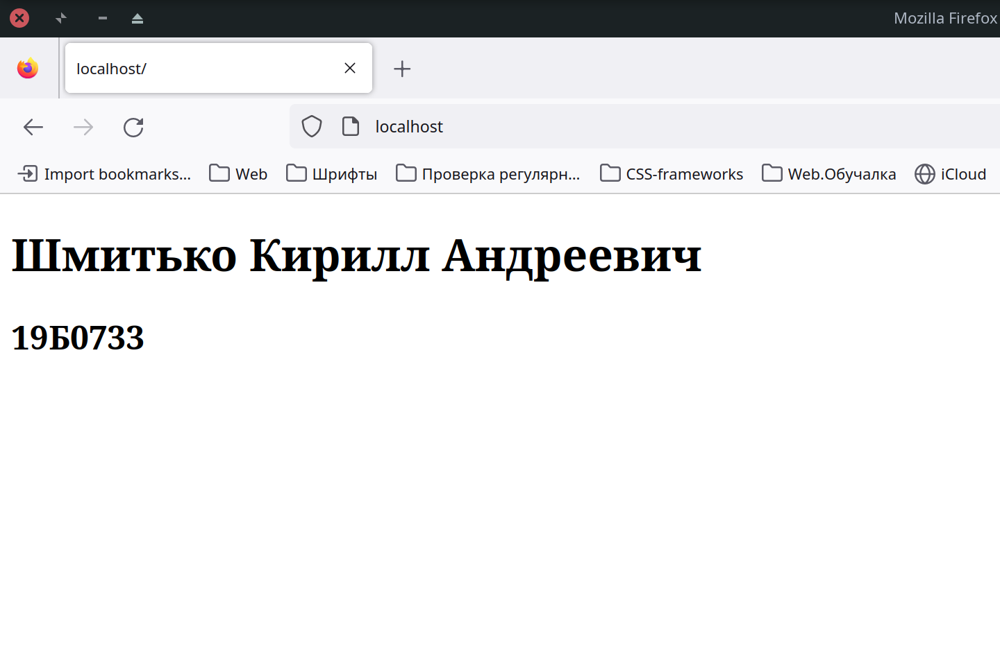
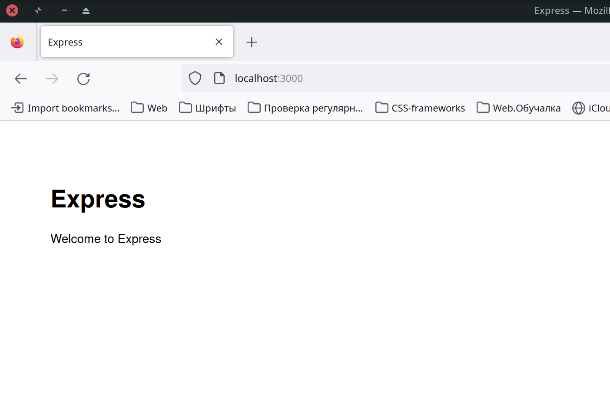
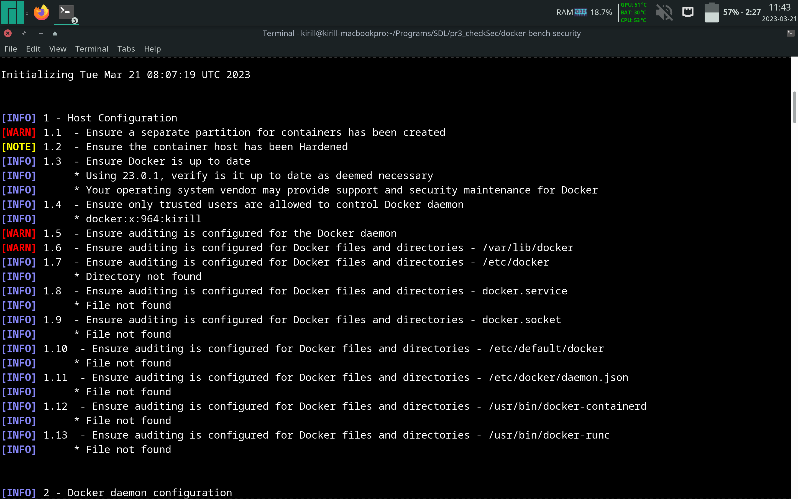
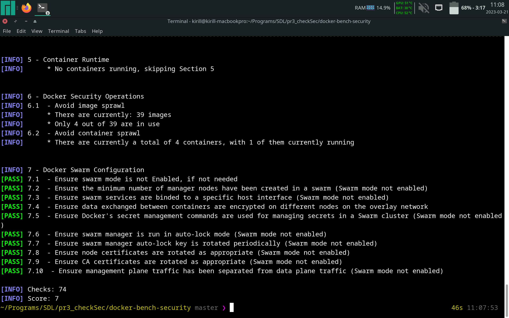
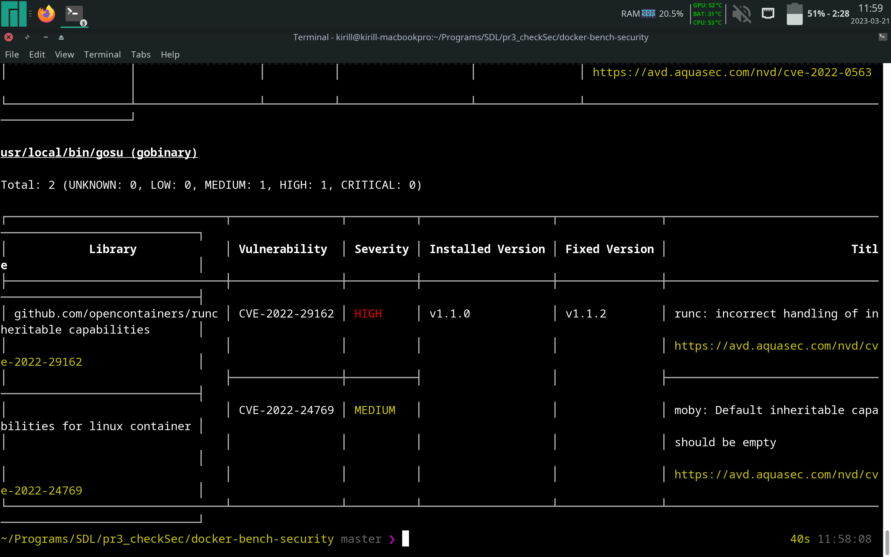

# Контейнер с тестовым проектом - HTML + nginx

1. Создадим Dockerfile:

    FROM nginx:alpine 
    COPY . /usr/share/nginx/html/

    EXPOSE 80

    CMD ["nginx", "-g", "daemon off;"]

2. Создадим простую HTML-страницу:

```html
    <!DOCTYPE html>
    <html>
        <head>
            <meta http-equiv="content-type" content="text/html; charset=utf-8" />
        </head>
        <body>
            <div>
                <h1>Шмитько Кирилл Андреевич</h1>
                <h2>19Б0733</h2>
            </div>
        </body>
    </html>
```

3. Для корректной работы сервера nginx создадим конфигурационный файл:

        server {
            listen 80;
            gzip_proxied any
            gzip_types
            text/plain
            text/css
            text/js
            text/xml
            text/javascript
            application/javascript
            application/x-javascript
            application/json
            application/xml
            application/rss+xml
            image/svg+xml
            gzip on;
            gzip_vary on;
            access_log  /var/log/nginx/access.log;
            error_log   /var/log/nginx/error.log;
            root /usr/share/nginx/html;
            index index.html index.htm;
            location / {
                try_files $uri $uri/ /index.html;
            }
        }

4. Соберем Docker-образ и запустим контейнер:
    
        docker build . -t website_image:first_version
            DEPRECATED: The legacy builder is deprecated and will be removed in a future release.
                        Install the buildx component to build images with BuildKit:
                        https://docs.docker.com/go/buildx/

            Sending build context to Docker daemon  4.608kB
            Step 1/4 : FROM nginx:alpine
            ---> 2bc7edbc3cf2
            Step 2/4 : COPY . /usr/share/nginx/html/
            ---> Using cache
            ---> 48298ad5f6b9
            Step 3/4 : EXPOSE 80
            ---> Using cache
            ---> f96ee41aebe6
            Step 4/4 : CMD ["nginx", "-g", "daemon off;"]
            ---> Using cache
            ---> 2cd1592f30cc
            Successfully built 2cd1592f30cc
            Successfully tagged website_image:first_version
        docker run --rm --name web -p 80:80 -d website_image:first_version
            243f4e65b2b1d288535f8286fd2e28861f7775c92435cc7e8a695fb8787b166c

5. В итоге, получаем по адресу "localhost:80" следующую страницу:

    

# Nodejs - приложение

1. Создадим Dockerfile:

    FROM node:10-alpine
    RUN mkdir -p /src/app
    WORKDIR /src/app

    COPY package.json /src/app/package.json
    RUN npm install

    COPY . /src/app
    EXPOSE 3000
    CMD [ "npm", "start" ] 

2. Создадим простую реализацию nodejs-application:

    var express = require('express');
    var path = require('path');
    var favicon = require('serve-favicon');
    var logger = require('morgan');
    var cookieParser = require('cookie-parser');
    var bodyParser = require('body-parser');

    var routes = require('./routes/index');
    var users = require('./routes/users');

    var app = express();

    // view engine setup
    app.set('views', path.join(__dirname, 'views'));
    app.set('view engine', 'jade');

    // uncomment after placing your favicon in /public
    //app.use(favicon(__dirname + '/public/favicon.ico'));
    app.use(logger('dev'));
    app.use(bodyParser.json());
    app.use(bodyParser.urlencoded({ extended: false }));
    app.use(cookieParser());
    app.use(express.static(path.join(__dirname, 'public')));

    app.use('/', routes);
    app.use('/users', users);

    // catch 404 and forward to error handler
    app.use(function(req, res, next) {
        var err = new Error('Not Found');
        err.status = 404;
        next(err);
    });

    // error handlers

    // development error handler
    // will print stacktrace
    if (app.get('env') === 'development') {
        app.use(function(err, req, res, next) {
            res.status(err.status || 500);
            res.render('error', {
                message: err.message,
                error: err
            });
        });
    }

    // production error handler
    // no stacktraces leaked to user
    app.use(function(err, req, res, next) {
        res.status(err.status || 500);
        res.render('error', {
            message: err.message,
            error: {}
        });
    });


    module.exports = app;

3. Соберем Docker-образ и запустим контейнер:

    docker build -t nodejs-app .
        DEPRECATED: The legacy builder is deprecated and will be removed in a future release.
                    Install the buildx component to build images with BuildKit:
                    https://docs.docker.com/go/buildx/

        Sending build context to Docker daemon  14.85kB
        Step 1/8 : FROM node:10-alpine
        ---> aa67ba258e18
        Step 2/8 : RUN mkdir -p /src/app
        ---> Using cache
        ---> 398ceafedb57
        Step 3/8 : WORKDIR /src/app
        ---> Using cache
        ---> b183b6a41778
        Step 4/8 : COPY package.json /src/app/package.json
        ---> Using cache
        ---> 8de149c77a10
        Step 5/8 : RUN npm install
        ---> Using cache
        ---> 53f57b1cb1e0
        Step 6/8 : COPY . /src/app
        ---> Using cache
        ---> 16c0610d9260
        Step 7/8 : EXPOSE 3000
        ---> Using cache
        ---> 33d7318b0f08
        Step 8/8 : CMD [ "npm", "start" ]
        ---> Using cache
        ---> 72f61f480878
        Successfully built 72f61f480878
        Successfully tagged nodejs-app:latest
    docker run -it --name production-nodejs-app -e NODE_ENV=production -p 3000:3000 nodejs-app

        > scrapbook-node-docker-client-as-container@1.0.0 start /src/app
        > node ./bin/www

        GET / 200 250.920 ms - 170
        GET /stylesheets/style.css 200 7.958 ms - 110
        GET /favicon.ico 404 45.833 ms - 160

4. В итоге получаем следующую веб страницу по адресу: "localhost:3000":

    

# Проверка Docker-контейнеров на безопасность

1. Для начала, воспользуемся утилитой docker-bench-security:

Программа анализирует конфигурацию Docker на нашем хосте. На основании данных
сообщений, можно выполнить необходимую конфигурацию.

    

    

На Рис. 3 можно наблюдать, что на машине не создано изолированное хранилище для
Docker - это необходимо, так как Docker выполняется от суперпользователя и с
помощью уязвимостей можно получить root-доступ к машине. 

2. Воспользуемся утилитой trivy:
    
Она позволяет проверить Docker-образ на наличие уязвимостей с их указанием. Это
помогает настроить образ под конкретные задачи, закрыв возможность
эксплуатировать уязвимость. К примеру, проверим образ "redis":

    

На Рис. 5 видно, что trivy обнаружила уязвимость CVE-2022-29162, которая
обозначает, что в runc до версии 1.1.2 была обнаружена ошибка, когда `runc exec
--cap` создавал процессы с непустыми наследуемыми возможностями процессов Linux,
создавая нетипичную среду Linux и позволяя программам с наследуемыми файловыми
возможностями повышать эти возможности до разрешенных. устанавливается во время
execve. 

Поэтому, рекомендуется регулярно ставить обновления на образы, чтобы постепенно
закрывать уязвимости, которые не удастся устранить при конкретной конфигурации.
